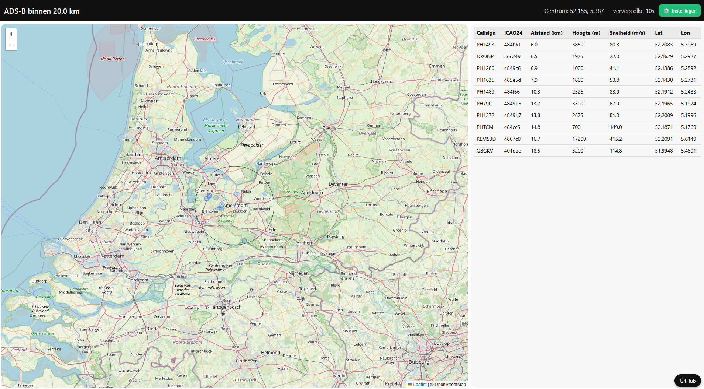

# adsb-alert

**adsb-alert** is a lightweight Flask + Leaflet web app to visualize aircraft around a location using the **ADSB.lol** API. It includes an optional headless worker for Telegram alerts based on a watchlist of callsigns. No database required—just a simple JSON config.

## Features
- Live aircraft map within a configurable radius (km)
- Details table (callsign, altitude, speed, distance)
- **Watchlist** with Telegram notifications (cooldown to avoid spam)
- Runs as a **web UI** and/or **headless worker**
- **Docker-first**: easy to build and run
- Configuration & cache via JSON files



## Quickstart (Docker)
```bash
docker build -t adsb-alert .
mkdir -p ./data
cp data/config.example.json ./data/config.json  # fill in your Telegram chat_id + token
docker run --rm -p 8000:8000       -e TZ=Europe/Amsterdam       -v $(pwd)/data:/app/data:rw       adsb-alert
```

Open http://localhost:8000 and adjust settings in the UI.

## Telegram alerts (optional)
In `data/config.json`:
```jsonc
{
  "watchlist": ["KLM123", "HV1234"],
  "telegram": {
    "token": "##TELEGRAMBOTTOKEN##",
    "chat_id": "##CHATID##",
    "cooldown_minutes": 5
  }
}
```

- For Telegram groups/supergroups, `chat_id` often looks like `-100...`.
- Make sure the bot is present in the group and allowed to send messages.

### Test Telegram
Use the **Test Telegram** button in the UI (Settings).  
Backend endpoint:
```
POST /api/settings/test-telegram
```
The response includes fields like `ok` and (if any) Telegram `description` to help debug (e.g. “chat not found”, “bot was blocked”).

## Headless alerts (worker)
Run a second container with the same image to keep alerts running without the UI being open:
```bash
docker run -d --name adsb-alert-worker       -e TZ=Europe/Amsterdam       -v $(pwd)/data:/app/data:rw       adsb-alert python -m app.worker
```

## Configuration
- `center.lat`, `center.lon` — map center in decimal degrees
- `radius_km` — search radius (km)
- `refresh_seconds` — UI refresh interval
- `ui_reads_cache_only` — UI reads cached `data/last_states.json`
- `cache_max_age_seconds` — stale threshold before UI shows “no data”

## Tech stack
- Backend: Python (Flask, Requests, Gunicorn)
- Frontend: Leaflet + vanilla JS/CSS
- Data provider: **ADSB.lol** (`/v2/point/{lat}/{lon}/{nm}`)
- Notifications: Telegram Bot API
- Storage: JSON config/state (no database)

## Development (local, no Docker)
```bash
python -m venv .venv
source .venv/bin/activate
pip install -r requirements.txt
export FLASK_APP=app/main.py
python -m flask run --port 8000
```

## Privacy & security
- **Do NOT commit** your real `data/config.json`. This repository includes `.gitignore` rules to ignore `data/*` runtime files.
- Ship only `data/config.example.json` with placeholders.

## License
MIT — see `LICENSE`.

## Links
- GitHub: https://github.com/rutgerh/adsb-alert
